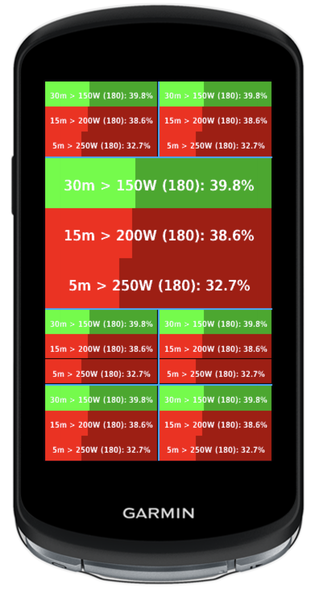

# Endurance in Zone

A Garmin IQ Data Field that can show time within a zone as a percentage of a target duration.

# Why?

Have you ever tried to do a structured endurance workout outdoors? It can be frustrating. You're trying to stick to a target power, but traffic, descents, and challenging road surfaces all do their best to derail your workout.

What can you do about it?

- Do your workouts indoors on a trainer. That will make it easy to stick to a structured workout, but it's not fun when your ride is several hours long.
- Just use average power or weighted average power, and make up for the dips in power by going harder elsewhere. The problem with this is that you're actually doing a harder workout than prescribed.
- Pause your workout whenever it's not possible to match the power target. I don't know about you, but where I live there are short descents all the time, and constantly pausing my ride seems very unnatural.
- Don't pause the workout, but use the lap button, and keep track of the total duration of "good" laps in your head. Needless to say, this takes some effort and is error-prone.
- Don't worry so much about the numbers. Just get the miles in, and do your best to stick to the target power. Sure, this can work, but it's not ideal if you care about the quality of your workouts.

There is a better option: use _Endurance in Zone!_

# Demo

<p float="left">
    
    
    
</p>

<p float="left">
    
    
</p>

# How does it work?

You can define up to three zones, each with a duration and a target power or heart rate. Whenever your 30-second average power or heart rate reaches the target, the zone background turns green, and the app will start counting up toward 100% of the configured duration. If your average power or heart rate dips below the target, the background will turn red, and the app will no longer count time toward your target duration. As you work toward the target duration, you will see a progress bar of light green or red against a dark green or red background.

If it has enough room, the data field will display something like this for each zone:

```
120m > 150W (122): 27.0%
```

This means that the target duration is 120 minutes, the target power is 150W, your current 30-second average is 122W, and you have completed 27.0% of the target duration.

If there isn't enough room for all of this, the current average will get dropped. If more space is needed, the target duration is dropped as well.

If you configure more than one zone, they are operating independent of each other. In other words, one zone can have a target power of 150W and another can have 200W. If you are outputting 250W, you are contributing to both of these zones, not just the highest one.

The app will not stop counting at 100%. The progress bar will get full, but the percentage number will continue counting, and the background will continue changing between green and red.

Why does the app use 30-second averages rather than current power or heart rate? Because your power does fluctuate a bit even when you are riding relatively steadily. If we used current power, you would see the power dipping below target a lot more, and you wouldn't get credited for all your effort. On the flip side, it will take up to 30 seconds until you reach your target zone, but it is the same when you stop riding, so this works out well. Keep in mind that the app is for tracking long, steady endurance efforts, and not short, spikey sprints.

## Example

Let's say your prescribed workout is like this:

- 15 minute warmup.
- 30 minutes at 170W.
- 20 minutes at 190W.
- 30 minutes at 170W.
- 5 minute cooldown.

I would configure two zones for this, one with 170W as target and the other with 190W. What should the durations be? For the second one, it is easy: 20 minutes. But what about the first one? Is it 2 * 30 minutes? Actually, it is 80 minutes. Remember, the zones are independent of each other, and you will stay above 170W for 80 minutes, not just 60.

# How to install

1. Find the app in the Garmin Connect IQ Store:
   https://apps.garmin.com/en-US/apps/5a07ddc6-055a-4d49-bd33-6f9314a1a828

2. Click to download it to your device.

3. Open Garmin Express or Garmin Connect, and sync with your device.

4. On your device, open the activity profile settings.

5. Configure data screens.

6. Select a data field, and go to the Connect IQ category.

7. Select _Endurance in Zone_.

8. Keep in mind that the bigger the data field, the more information and/or bigger font you get.

# How to configure

1. Make sure your device is on, and open the Garmin Connect app on your phone.

2. Make sure the device shows as connected in Garmin Connect, and touch it to open a menu.

3. Select _Activities & App Management_.

4. Select _Data Fields_.

5. Select _Endurance in Zone_.

6. Select _Settings_.

7. Choose if you want to target power or heart rate. If you choose power, you can ignore the heart rate settings, and vice versa.

8. Configure _Time in zone A_ and its power or heart rate target.

9. If you want to use more zones, include zone B and/or C, and configure them the same way.

# TODO

- [x] Show time in zone as a percentage of desired duration.
- [x] Show green/red background indicating if you are currently reaching the target or not.
- [x] Configurable power zones as app settings.
- [x] Show three independent zones concurrently.
- [x] Reset data when activity ends.
- [x] Use 30 second average rather than current power.
- [x] Show 1-3 zones properly, as configured.
- [x] Display properly on various data field sizes, truncating where needed.
- [x] Use the largest font that will fit.
- [x] Support heart rate as well as power.
- [x] Use light/dark red/green to achieve a progress look.
- [x] Black/white support.
- [x] Restore data if app is suspended and resumed.
- [x] Rename to Endurance in Zone
- [x] Use white text colour.
- [x] Adjust one pixel down.
- [x] Tested on all devices using simulator, incl. oldest and newest, round watches, and black/white.
- [x] Update docs.
- [x] Update images.
- [ ] Test crash report.
- [ ] Publish first version.
- [ ] Market.
